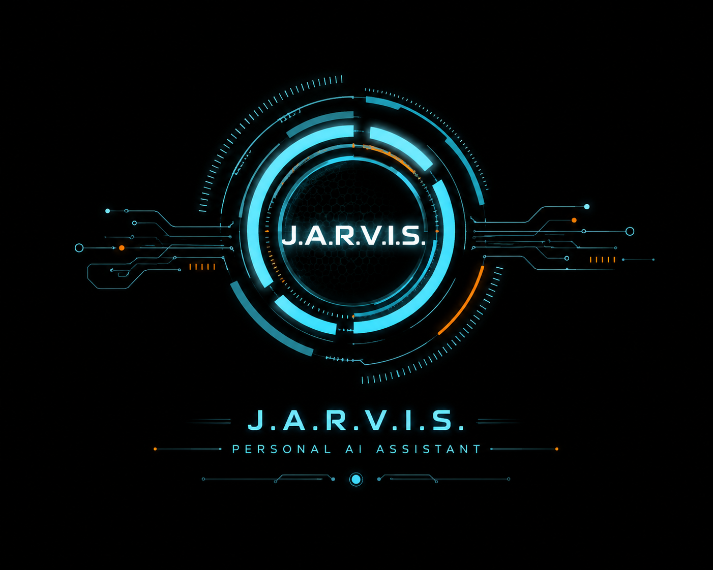

# J.A.R.V.I.S — Desktop AI Assistant

**J.A.R.V.I.S** is a personal, voice-enabled **desktop AI assistant for Windows**, powered by
**local LLMs via [Ollama](https://ollama.com)**. It has a dark, Iron-Man–styled
("JARVIS HUD") GUI built with [`customtkinter`](https://github.com/TomSchimansky/CustomTkinter)
and runs **fully offline** — the models are downloaded and executed locally, so no
prompt or data ever has to leave your machine.



---

## Features

- **Streaming chat** with local models (token-by-token output, with stop / regenerate / copy support)
- **Voice input** (SpeechRecognition + pyaudio) and **voice output** (pyttsx3 TTS, with a mute toggle)
- **Vision** — analyze a screenshot or any image file with a vision model
- **Persistent memory** — `remember key=value` writes to `memory.json`
- **Persistent chat history** — `chat_history.json`, replayed on launch
- **App / website launcher** — VS Code, Edge, Notepad, Calculator, Downloads, YouTube, GitHub, ChatGPT
- **System commands** — time/date, battery status, system status (CPU/RAM/net), and
  shutdown/restart (with confirmation)
- **Auto model routing** — picks a small fast model for casual chat and a bigger coder model
  for code, and stays ("sticks") on the coder model through a coding conversation
- **Offline-friendly health check** — the status dot is green when Ollama is reachable, red when it's down
- Packaged as a standalone **`.exe`** via PyInstaller

---

## Architecture

The app is split into GUI-agnostic backend logic and the GUI, so the core can be unit-tested
without a display:

| File | Purpose |
|---|---|
| `jarvis_gui.py` | Main application (~2000 lines). The GUI — this is the file you edit. |
| `jarvis_gui.pyw` | Byte-for-byte identical copy of `jarvis_gui.py` with a `.pyw` extension (runs without a console window). **Keep the two in sync.** |
| `jarvis_backend.py` | GUI-agnostic logic: `MemoryStore`, `ChatHistory`, system-prompt building, request-message assembly. |
| `jarvis_providers.py` | Provider abstraction for local Ollama and (optional) cloud models. All network/model inference goes through here — no shell exec, no autonomous actions. |
| `jarvis.py` | Headless (terminal) edition that shares `memory.json` / `chat_history.json` with the GUI. |
| `config.toml` | Optional config for a cloud LLM router (only used for non-Ollama providers). Git-ignored by default -- **keep any secrets local and never commit them.** |
| `run_venv.ps1` | Launcher that runs a script under the project's `win-venv` and (by default) starts the Ollama server if it isn't already up. |
| `build_exe.bat` | Builds `dist\JARVIS.exe` with PyInstaller (onefile, windowed, custom icon). |
| `tests/` | Pytest suite for the backend (e.g. `tests/test_backend_fix2.py`). |

---

## Requirements

- **Windows** (the app is Windows-first; a few paths/launchers are Windows-specific)
- **Python 3** (tested with 3.14 in the bundled `win-venv`)
- **[Ollama](https://ollama.com)** installed and running, with at least one model pulled
- Python packages (also listed in `requirements.txt`):

  ```
  customtkinter
  Pillow
  ollama
  pyttsx3
  pyautogui
  psutil
  SpeechRecognition
  pyaudio
  ```

  (`pyperclip` is an optional dependency used for clipboard copy; the app falls back to Tk's clipboard if it isn't installed.)

---

## Setup

1. **Install Ollama** and pull a model, e.g.:

   ```powershell
   ollama pull qwen2.5:3b
   ollama pull qwen2.5-coder:7b      # used by "auto" routing for coding
   ollama pull llama3.2-vision:latest  # default vision model
   ```

   The model list shown in the GUI is populated dynamically from `ollama list()`;
   the hardcoded fallback set is `["auto", "qwen2.5:3b", "qwen2.5-coder:7b"]`.

2. **Create the virtual environment** (PowerShell):

   ```powershell
   python -m venv win-venv
   win-venv\Scripts\pip install -r requirements.txt
   ```

3. **Run the assistant**:

   ```powershell
   .\run_venv.ps1 jarvis_gui.py
   ```

   `run_venv.ps1` forces the project `win-venv` interpreter and auto-starts the
   Ollama server (pass `-NoOllama` to skip that).

   To run the headless/terminal edition instead:

   ```powershell
   .\run_venv.ps1 jarvis.py
   ```

### Build a standalone `.exe`

```powershell
.\build_exe.bat      # output: dist\JARVIS.exe
```

---

## Usage

- Type in the input bar and press **Enter** to send.
- **↑ / ↓** cycle through previously sent messages.
- **Ctrl+L** clear screen · **Ctrl+E** export chat · **Ctrl+M** mute voice · **Ctrl+Q** quit.
- Hover over the **＋** (attach) menu or the icon buttons for tooltips.
- Pick a model in the input bar or in **Settings** (model, vision model, temperature,
  response length, and keep-alive are all adjustable).
- In **Auto** mode the assistant sticks with the coder model through a coding
  conversation instead of switching models on every message.

### Commands

Type these in the chat box:

**Memory**
- `remember key=value` · `recall key` · `show memory` · `forget key`

**Vision**
- `analyze image` (opens a file picker) · `screenshot` (captures + analyzes the screen)
- or use the **＋** menu / the **Vision** action in the sidebar

**Chat history**
- `new chat` (fresh conversation) · `clear screen` (wipe visible text) ·
  `clear history` (wipe saved history) · `export chat` (save as `.md`)

**Conversation controls**
- `regenerate` (redo the last answer) · `stop` (cancel a reply mid-stream)
- **＋** menu also has: copy last reply, regenerate, export, help

**Web & apps**
- `search <anything>` (Google search)
- `open edge` · `open vscode` · `open downloads` · `open notepad` · `open calculator`
- `open youtube` · `open github` · `open chatgpt`

**Utilities**
- `what time is it` · `whats todays date`
- `shutdown pc` / `restart pc` (asks for confirmation)
- `battery` (laptop charge/plug state) · `system status` (CPU/RAM/battery/network/Ollama)

Type `help` in the chat for the in-app command reference.

---

## Testing

```powershell
win-venv\Scripts\python.exe -m pytest tests/ -q
```

---

## Notes & conventions

- The GUI talks to Ollama through `jarvis_providers` with an explicit connect timeout so a
  slow/unreachable server can't freeze the UI; streaming generations are allowed to run long.
- All worker-thread GUI updates go through `app.after(...)` (Tkinter is not thread-safe).
- `memory.json`, `chat_history.json`, and `jarvis.log` are runtime files and are git-ignored.
- `jarvis_gui.pyw` **must stay byte-identical** to `jarvis_gui.py`.

## License

MIT — see [LICENSE](LICENSE).

